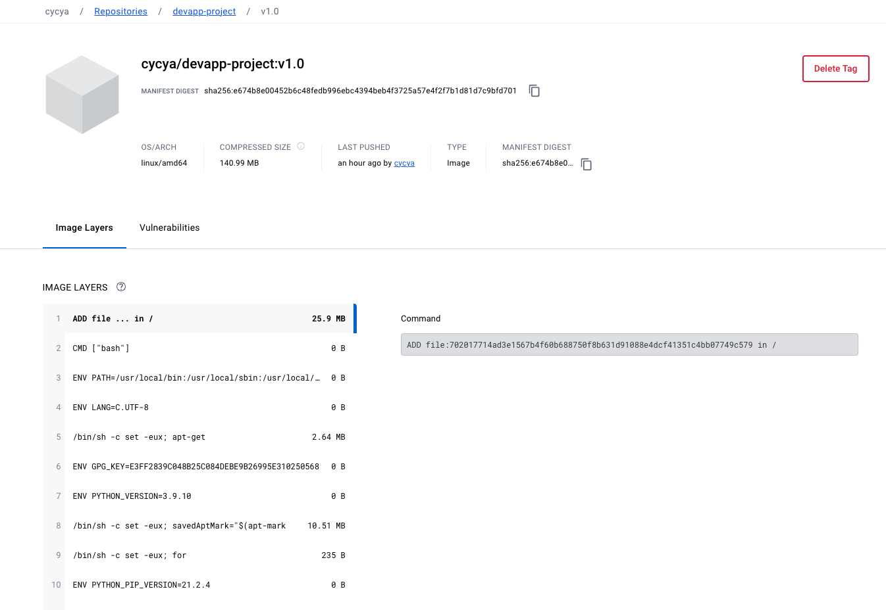

# Web-App-DevOps-Project

Welcome to the Web App DevOps Project repo! This application allows you to efficiently manage and track orders for a potential business. It provides an intuitive user interface for viewing existing orders and adding new ones.

## Table of Contents

- [Features](#features)
- [Getting Started](#getting-started)
- [Technology Stack](#technology-stack)
- [Contributors](#contributors)
- [License](#license)

## Features

- **Order List:** View a comprehensive list of orders including details like date UUID, user ID, card number, store code, product code, product quantity, order date, and shipping date.
  


- **Pagination:** Easily navigate through multiple pages of orders using the built-in pagination feature.
  


- **Add New Order:** Fill out a user-friendly form to add new orders to the system with necessary information.
  


- **Data Validation:** Ensure data accuracy and completeness with required fields, date restrictions, and card number validation.

## Getting Started

### Prerequisites

For the application to succesfully run, you need to install the following packages:

- flask (version 2.2.2)
- pyodbc (version 4.0.39)
- SQLAlchemy (version 2.0.21)
- werkzeug (version 2.2.3)

### Usage

To run the application, you simply need to run the `app.py` script in this repository. Once the application starts you should be able to access it locally at `http://127.0.0.1:5000`. Here you will be meet with the following two pages:

1. **Order List Page:** Navigate to the "Order List" page to view all existing orders. Use the pagination controls to navigate between pages.

2. **Add New Order Page:** Click on the "Add New Order" tab to access the order form. Complete all required fields and ensure that your entries meet the specified criteria.

## Technology Stack

- **Backend:** Flask is used to build the backend of the application, handling routing, data processing, and interactions with the database.

- **Frontend:** The user interface is designed using HTML, CSS, and JavaScript to ensure a smooth and intuitive user experience.

- **Database:** The application employs an Azure SQL Database as its database system to store order-related data.

## Version Control
The first step is to clone the repository from github to my local machine so I can develop on my local machine and push, pull, merge and revert changes throughout development.
Some of the features that I will be using through the development of the project will be:
- Cloning: Allows devlopers to copy the entire repo onto their local machine
```bash
git clone <project-url>
```
- Push: Pushes any staged changes a developer has made to the repository for all other developers to see
```bash
git push
```
- Branching: Branching enables the isolation of work in progress, allowing developers to work on features or fixes without impacting the main codebase until ready. Creating a new branch is done using the following command
```bash
git checkout -b <new branch name>
```
- Revert:  Revert functionality provides the ability to undo changes made to the codebase, restoring it to a previous state if necessary. Reverting to a previousu version is done with the following command where the commit hash is the desired version you may wish to rollback to
```bash
git revert <commit hash>
```
- Pull Requests: Pull requests allow for collaboration and code review by proposing changes from a feature branch to the main branch for merging prior to actually merging branches. This is done in the GitHub web page


The **Delivery Date Column** feature aimed to provide additional information about the delivery process within the company's internal application. It introduced a new database column, `delivery_date`, to store and display delivery dates associated with orders.

## Docker (Containerization)
Docker containerization significantly benefits the DevOps Project by providing portability, isolation, and reproducibility. Containers encapsulate the application and its dependencies, ensuring consistent performance across different environments. The lightweight nature of containers enhances resource efficiency and scalability, allowing for seamless deployment and easy horizontal scaling. Docker's versioning capability and centralized repository, Docker Hub, streamline collaboration and version control.

### How It Works - Docker Containerization Process

#### Step 1: Dockerfile Creation
Create a Dockerfile in the project root directory specifying the application's dependencies and configuration.

```Dockerfile
# TODO: Step 1 - Use an official Python runtime as a parent image
FROM python:3.8-slim

# TODO: Step 2 - Set the working directory in the container
WORKDIR /app

# TODO: Step 3 - Copy the application files into the container
COPY . /app

# TODO: Step 4 - Install Python packages specified in requirements.txt
RUN pip install --upgrade pip setuptools
RUN pip install -r requirements.txt

# TODO: Step 5 - Expose port
EXPOSE 5000

# TODO: Step 6 - Define Startup Command
CMD ["python", "app.py"]
```
#### Step 2: Building the Docker Image
```Bash
docker build -t devapp-project:v1.0 .
```
#### Step 3: Tagging the Image
```Bash
docker tag devapp-project:v1.0 cycya/devapp-project:v1.0
```
#### Step 4: Pushing to Docker Hub
```Bash
docker push cycya/devapp-project:v1.0
```
#### Step 5: Testing Push (Pulling from DockerHub)
```Bash
docker pull cycya/devapp-project:v1.0
```
#### Step 6: Running Locally
```Bash
docker run -p 5001:5000 devapp-project:v1.0
```
####  Step 7: Clean Up
```Bash
# Remove containers
docker ps -a
docker rm <container-id>
# Remove images
docker images -a
docker rmi <image-id>
```


## Contributors 

- [Maya Iuga]([https://github.com/yourusername](https://github.com/maya-a-iuga))
- [Mercy Azeta]([https://github.com/yourusername](https://github.com/A-ZtCode))

## License

This project is licensed under the MIT License. For more details, refer to the [LICENSE](LICENSE) file.
